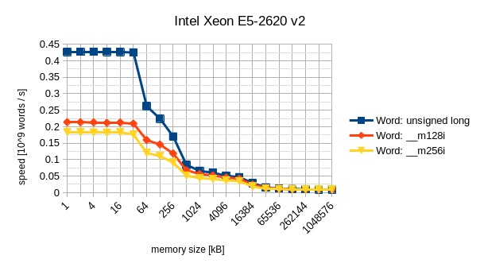
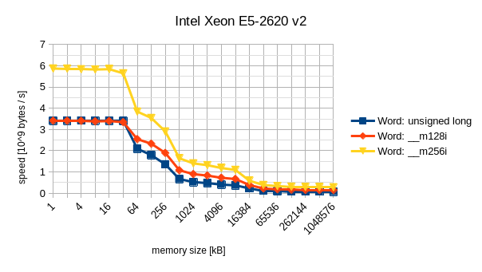
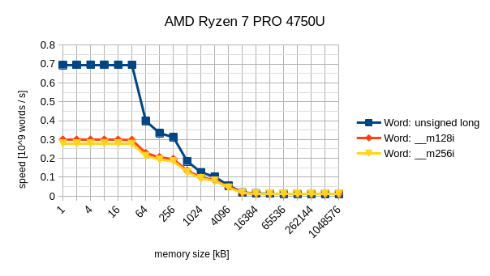
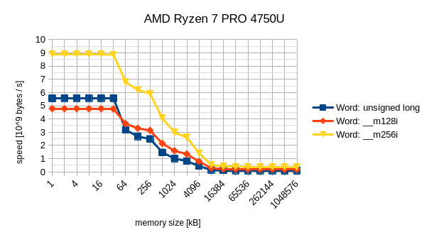
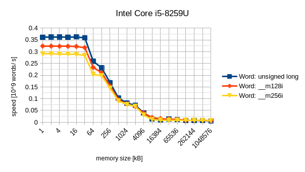
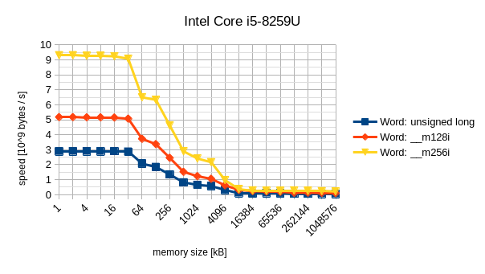

Perfomance Micro Benchmarks
===

A collection of performance micro benchmarks in C++.


Content
---

- [Benchmarks for cache and memory speed](benchmark/memory-access/performance-micro-benchmarks/memory-access/benchmark_memory_access.cpp).
- [Benchmarks for system calls](benchmark/syscall/performance-micro-benchmarks/syscall/benchmark_syscall.cpp).
- A number of benchmarks for evaluating different methods for dependency injection: 
  [benchmark for dependency injection using C++ concepts](benchmark/dependency-injection-header-only/performance-micro-benchmarks/header-only/concepts/benchmark_user.cpp),
  [benchmark for dependency injection using CRTP](benchmark/dependency-injection-header-only/performance-micro-benchmarks/header-only/crtp/benchmark_user.cpp),
  [benchmark for dependency injection using pure virtual interface class](benchmark/dependency-injection-header-only/performance-micro-benchmarks/header-only/oo/benchmark_user.cpp),
  [benchmark for dependency injection using template duck typing](benchmark/dependency-injection-header-only/performance-micro-benchmarks/header-only/template-duck-typing/benchmark_user.cpp).


Build
---

```
$ mkdir build && cd build
$ cmake .. && make
```
Executable build artifacts are located in the folders `benchmark` and `test`.
```
$ find benchmark test -type f -executable
benchmark/dependency-injection-header-only/dependency-injection-header-only-benchmarks
benchmark/memory-access/memory-access-benchmarks
benchmark/dependency-injection-static-library/dependency-injection-static-library-benchmarks
benchmark/syscall/syscall-benchmarks
benchmark/dependency-injection-shared-library/dependency-injection-shared-library-benchmarks
test/unit/dependency-injection-header-only/dependency-injection-header-only-unit-tests
```


Measuring cache and memory speed
---

Figures 1 to 6 show measurements of memory access times on three different CPUs. Figures 1 and 2 are obtained from an Intel Xeon E5-2620 v2 CPU. Figures 3 and 4 are obtained from an AMD Ryzen 7 PRO 4750U CPU. Figures 5 and 6 are obtained from an Intel Core i5-8259U CPU. The source code for the benchmark can be found in [benchmark_memory_access.cpp](benchmark/memory-access/performance-micro-benchmarks/memory-access/benchmark_memory_access.cpp).

|  |
|:--:|
| *Figure 1: Cache and memory random read in words per second on an Intel Xeon E5-2620 v2 with 32KiB L1 cache, 256 KiB L2 cache, and 15360KiB L3 cache.* |

|  |
|:--:|
| *Figure 2: Cache and memory random read in bytes per second on an Intel Xeon E5-2620 v2 with 32KiB L1 cache, 256 KiB L2 cache, and 15360KiB L3 cache.* |

|  |
|:--:|
| *Figure 3: Cache and memory random read in words per second on an AMD Ryzen 7 PRO 4750U with 32KiB L1 cache, 256 KiB L2 cache, and 4096KiB L3 cache.* |

|  |
|:--:|
| *Figure 4: Cache and memory random read in bytes per second on an AMD Ryzen 7 PRO 4750U with 32KiB L1 cache, 256 KiB L2 cache, and 4096KiB L3 cache.* |

|  |
|:--:|
| *Figure 5: Cache and memory random read in words per second on an Intel Core i5-8259U with 32KiB L1 cache, 256 KiB L2 cache, and 6144KiB L3 cache.* |

|  |
|:--:|
| *Figure 6: Cache and memory random read in bytes per second on an Intel Core i5-8259U with 32KiB L1 cache, 256 KiB L2 cache, and 6144KiB L3 cache.* |


License
-------

This project is licensed under the BSD-3-Clause license - see the [LICENSE.md](LICENSE.md) file for details.
